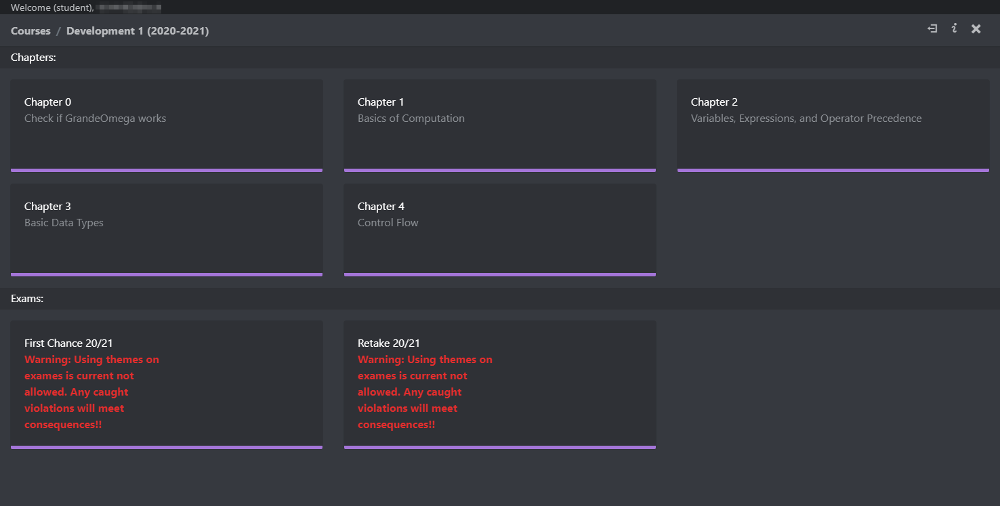
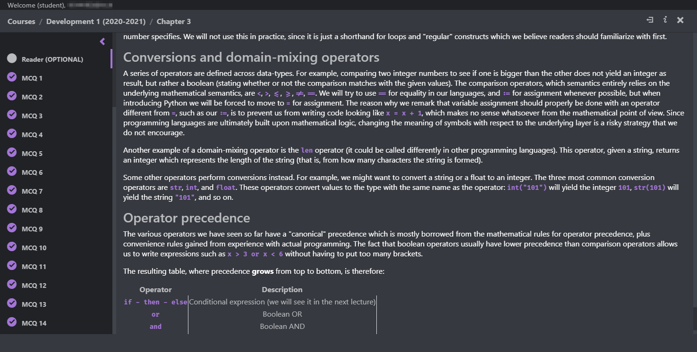
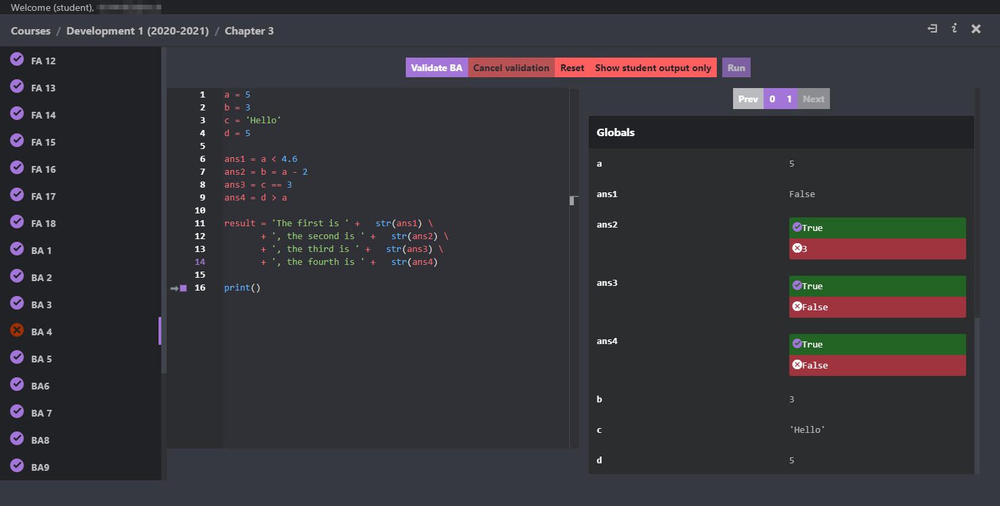

<!-- @format -->

# `Midnight Jam` modified by Matthbo

A soothing dark mode skin for late-mid-night coding session,
or for you just want to ease your eyes with darkness.
 
**This theme lets you select the accent colors if you wish.**
 

_Inspired by discord_

---

## `Screenshots`
- TODO (perhaps)

<!-- 

 -->

---

## `Skin Installation`

Make sure to `backup the folders you are gonna overwrite` first, in case you need them

 
Installation steps:

1. ~~`Read the instruction` on https://github.com/Grande-Omega-Skins/Grande-Omega-Skins#resource-folder-locations.~~

2. `Download` the latest release for this skin, ~~see the release section on the right on the repo of that skin.~~  
    Download this repo with the "↓ Code" button and select the ZIP file.

3. `Extract` the contents of `Midnight-Jam/dist` on top of your resource folder.

4. `Replace the files` you're asked to replace. Next time you start Grande Omega it should appear in this skin.

To change skin, restore the resource folder from the copy you made and repeat the installation steps.

---

## `Accent color`

1. Make sure you've `completely installed` the skin using the previous steps.

2. Locate the `midnightjam.css` file under `dist/wwwroot/css`

3. Open this file and `read the instruction on the accents`, all the way on top of the file

4. Save the file and close it

5. Open `Grande Omega` and enjoy!

---
